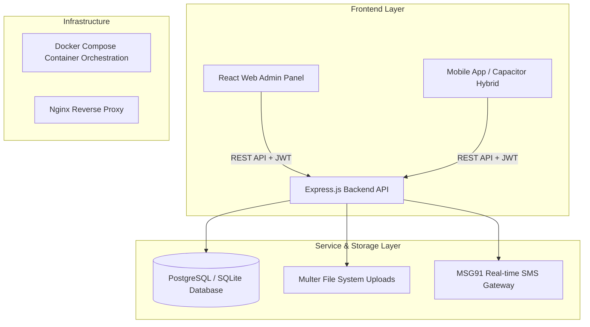
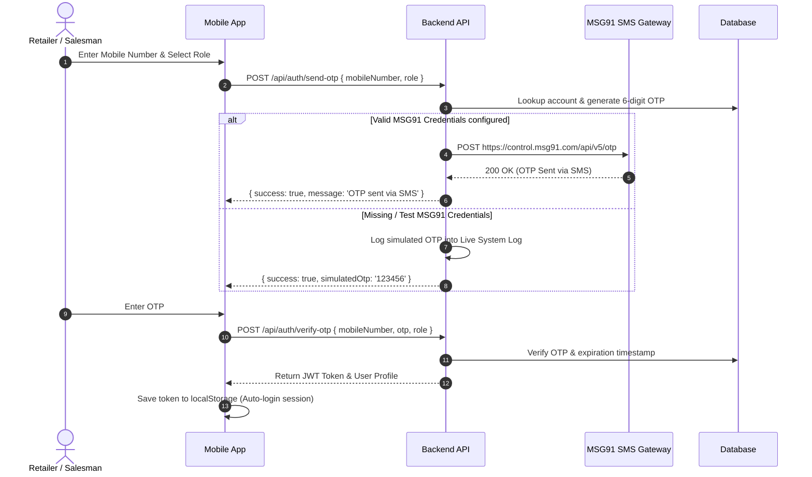
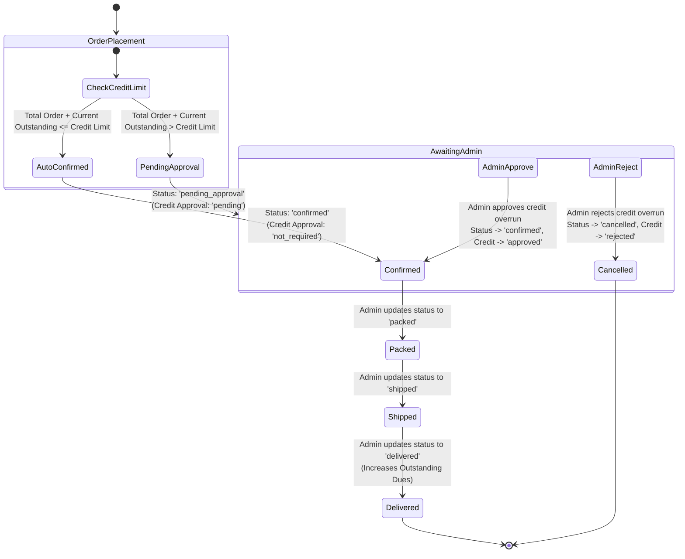

# Biswas Distribution System (Lapcare B2B Platform)

> **Enterprise B2B Distribution, Order Processing & Credit Management System**  
> Scalable architecture designed for ~350+ retailers, tier-based pricing (T1/T2/T3), field salesman proxy ordering, real-time credit limit enforcement, and head-office administration.

---

## 📋 Table of Contents
1. [Executive Summary](#-executive-summary)
2. [System Architecture & Tech Stack](#-system-architecture--tech-stack)
3. [User Roles & Capabilities](#-user-roles--capabilities)
4. [Complete End-to-End Application Flow](#-complete-end-to-end-application-flow)
   - [Flow 1: Authentication & Onboarding (MSG91 SMS Gateway)](#flow-1-authentication--onboarding-msg91-sms-gateway)
   - [Flow 2: Tiered Product Pricing & Catalog Resolution](#flow-2-tiered-product-pricing--catalog-resolution)
   - [Flow 3: Order Lifecycle & Credit Approval State Machine](#flow-3-order-lifecycle--credit-approval-state-machine)
   - [Flow 4: Dues Accounting & Dynamic Outstanding Balance Flow](#flow-4-dues-accounting--dynamic-outstanding-balance-flow)
   - [Flow 5: Salesman Proxy Ordering & Monthly Performance Flow](#flow-5-salesman-proxy-ordering--monthly-performance-flow)
5. [Application Manual & Operating Guides](#-application-manual--operating-guides)
   - [Administrator Manual (Head Office)](#51-administrator-manual-head-office)
   - [Retailer User Manual (Mobile App)](#52-retailer-user-manual-mobile-app)
   - [Salesman Field Manual (Mobile App)](#53-salesman-field-manual-mobile-app)
6. [API Endpoint Reference](#-api-endpoint-reference)
7. [Installation, Environment & Deployment Guide](#-installation-environment--deployment-guide)
8. [Testing & Verification Utilities](#-testing--verification-utilities)

---

## 🏢 Executive Summary

**Biswas Distribution System** (Lapcare B2B) is a complete B2B ordering and credit distribution platform tailored for electronics and computer peripherals distribution networks.

The system connects three key operational pillars:
1. **Head Office Administration**: Centralized Web Admin Portal for controlling pricing tiers, stock levels, retailer credit approvals, salesman targets, and offline payment collections.
2. **Retail Partners**: Mobile-first ordering portal enabling ~350+ retailers to browse custom-tiered pricing, request credit terms, place orders, write product reviews, and monitor outstanding dues.
3. **Sales Representatives**: Mobile field application allowing sales representatives to switch retailer contexts on-the-fly, place orders on behalf of assigned shops, and track monthly order/revenue targets.

*Note: The platform handles offline payment settlements (Cash, Cheque, Bank Transfer, UPI). No online payment gateway is required — credit limits and due payment ledger accounting govern the ordering flow.*

---

## 🏗️ System Architecture & Tech Stack



### Technology Breakdown

| Component | Technology | Description |
| :--- | :--- | :--- |
| **Frontend Framework** | React (Vite) | Single Page Application supporting dual views (Web Admin + Mobile Simulator). |
| **Mobile Runtime** | Capacitor / Web PWA | Android-native compilation ready via Capacitor (`@capacitor/core`). |
| **Backend Service** | Node.js (Express) | High-performance RESTful API with modular middleware and authentication. |
| **Database ORM** | Sequelize | Multi-dialect ORM with production support for PostgreSQL and SQLite. |
| **Authentication** | JWT + MSG91 SMS | Secure JWT bearer tokens + MSG91 OTP SMS dispatch with simulation fallback. |
| **File Handling** | Multer | Multipart upload engine supporting product image attachments up to 20MB. |
| **Containerization** | Docker & Docker Compose | Multi-container setup orchestrating Web Server, Node API, and PostgreSQL DB. |

---

## 👤 User Roles & Capabilities

```
+-----------------------------------------------------------------------+
|                           BISWAS DISTRIBUTION                         |
+-----------------------------------++----------------------------------+
                                    ||
           +------------------------++------------------------+
           |                                                  |
           v                                                  v
  +------------------+                              +------------------+
  |  ADMIN PORTAL    |                              |   MOBILE APP     |
  |   (Head Office)  |                              |  (Field & Shop)  |
  +--------+---------+                              +--------+---------+
           |                                                 |
           v                                        +--------+--------+
  - Catalog & Tier Pricing                          |                 |
  - Credit Limit Approvals                          v                 v
  - Retailer / Salesman Mgmt               +----------------+ +----------------+
  - Payment Ledger & Settlement            | RETAILER ROLE  | | SALESMAN ROLE  |
                                           +----------------+ +----------------+
                                           - Tier Catalog     - Select Retailer
                                           - Place Orders     - Order on Behalf
                                           - Request Credit   - Target Metrics
                                           - Track Dues       - Track Dues
```

| Feature | Admin (Super Admin) | Retailer | Salesman |
| :--- | :---: | :---: | :---: |
| Access Platform | Web Admin | Mobile App | Mobile App |
| View Tier Pricing | All Tiers (T1, T2, T3) | Assigned Tier Only | Selected Retailer Tier |
| Place Orders | ❌ | ✅ (Own Shop) | ✅ (Assigned Retailers) |
| Credit Limit Approval | ✅ Approve/Reject | ❌ (Subject to approval) | ❌ (Subject to approval) |
| Manage Retailer Accounts | ✅ Full Control | ❌ | ❌ (View Assigned Only) |
| Manage Product Catalog | ✅ Add/Edit/Delete | ❌ | ❌ |
| Record Dues & Payments | ✅ Settle Dues | ❌ (View Dues Only) | ❌ (View Dues Only) |
| Target Monitoring | ✅ Set Monthly Targets | ❌ | ✅ Own Target Progress |

---

## 🔄 Complete End-to-End Application Flow

### Flow 1: Authentication & Onboarding (MSG91 SMS Gateway)



---

### Flow 2: Tiered Product Pricing & Catalog Resolution

Retailers are categorized into three pricing tiers: **T1** (Gold/High Volume), **T2** (Silver/Mid Volume), and **T3** (Standard Volume).

- When a Retailer or Salesman requests products via `GET /api/products`:
  1. The API verifies the authenticated user's assigned tier (`category`).
  2. The unit price for each product is dynamically resolved:
     - Tier `T1` $\rightarrow$ `product.priceT1`
     - Tier `T2` $\rightarrow$ `product.priceT2`
     - Tier `T3` $\rightarrow$ `product.priceT3`
  3. The catalog returns unit prices relevant *only* to the active retailer context.

---

### Flow 3: Order Lifecycle & Credit Approval State Machine



---

### Flow 4: Dues Accounting & Dynamic Outstanding Balance Flow

1. **Outstanding Calculation Rule**:
   $$\text{Current Outstanding} = \sum (\text{Confirmed/Delivered Credit Orders}) - \sum (\text{Recorded Dues Transactions})$$
2. **Order Placement Impact**:
   - Cash-on-Delivery (COD) orders do not consume retailer credit limit.
   - Credit Terms (`due_7`, `due_15`, `due_30`) immediately check against `creditLimit - currentOutstanding`.
3. **Payment Settlement**:
   - Admin receives offline payment (Cash, Cheque, Bank Transfer, UPI).
   - Admin opens **Dues & Payments** in Admin Portal and enters transaction details.
   - Backend triggers `syncRetailerOutstanding(retailerId)` inside a database transaction to recalculate and store the updated running balance.

---

### Flow 5: Salesman Proxy Ordering & Monthly Performance Flow

1. **Context Switch**: Salesman logs into the Mobile App and views their assigned list of retailers.
2. **Retailer Selection**: Salesman selects a retailer (e.g., "M/s Royal Electronics").
3. **Proxy Catalog & Order**:
   - The app adapts to Royal Electronics' pricing tier (e.g., T2).
   - Salesman adds products to cart, selects Royal Electronics' delivery address, and submits the order.
   - Order record marks `placedByRole = 'salesman'` and `placedById = salesman.id` while linking `retailerId = royalElectronics.id`.
4. **Target Resolution**:
   - The system aggregates all orders placed by the Salesman during the calendar month.
   - Progress bar compares actual total revenue and dues collected against the monthly target targets set by Admin.

---

## 📖 Application Manual & Operating Guides

### 5.1 Administrator Manual (Head Office)

#### 1. Navigating the Admin Dashboard
- **Access**: Open `http://localhost:8081` (or your domain) in Google Chrome / Edge.
- **Login**: Enter Admin Credentials (Default: `admin@lapcare.com` / `admin123`).
- **Dashboard Overview**:
  - **KPI Cards**: Displays Monthly Revenue, Active Retailers, Pending Credit Approvals, and Total Outstanding Dues.
  - **Live System Log Terminal**: Displays real-time SMS notifications, OTP dispatches, and system alerts.

#### 2. Managing Retailers & Credit Limits
1. Navigate to **Retailers** in the side navigation.
2. Click **+ Add Retailer** to register a new shop:
   - Fill in Shop Name, Mobile Number, Email, Password, Category (`T1`, `T2`, or `T3`), and initial **Credit Limit (₹)**.
   - Assign a primary **Salesman**.
3. **Updating Credit Limits**: Click **Edit** on any retailer row to adjust their credit limit or tier category at any time.

#### 3. Managing Product Catalog & Stock
1. Navigate to **Products & Catalog**.
2. Click **+ Add Product**:
   - Input SKU, Product Name, Brand, Category, HSN Code, and GST Rate.
   - Set separate pricing for **T1**, **T2**, and **T3** tiers.
   - Upload high-resolution product images (up to 20MB per image).
   - Set Stock Quantity and Low Stock Alert Threshold.
3. Click **Save Product**.

#### 4. Processing Credit Approval Requests
1. Navigate to **Orders** $\rightarrow$ Filter by **Pending Approval**.
2. Orders exceeding a retailer's credit limit will show a highlighted alert: `CREDIT LIMIT EXCEEDED`.
3. Review order items, retailer history, and current outstanding dues.
4. Click **Approve Order** (with optional note) to transition the order to `confirmed` status, or click **Reject Order** to cancel.

#### 5. Recording Dues Payments & Issuing Receipts
1. Navigate to **Dues & Payments**.
2. Select the Retailer from the dropdown list to view their live Ledger & Outstanding Dues.
3. Click **+ Record Payment**:
   - Enter Payment Amount, Mode (Cash / Cheque / Bank Transfer / UPI), Transaction Reference / Cheque No., and Date.
4. Click **Submit Payment**. The system instantly updates the retailer's current outstanding balance and provides a printable payment receipt.

---

### 5.2 Retailer User Manual (Mobile App)

#### 1. Logging In
1. Launch the **Biswas Distribution** mobile application.
2. Select role **Retailer** and enter your registered 10-digit Mobile Number.
3. Tap **Send OTP**. Enter the 6-digit OTP received via SMS (or simulated log) and tap **Verify & Login**.

#### 2. Browsing Products & Placing Orders
1. **Catalog View**: Browse products sorted by categories or search by SKU/product name.
2. **Tier Price**: You will automatically see prices formatted for your assigned store tier.
3. **Cart Setup**: Tap **Add to Cart**, select quantities, and proceed to Cart Checkout.
4. **Checkout**:
   - Select Delivery Address (or add a new delivery location).
   - Select Payment Terms:
     - **COD (Cash on Delivery)**
     - **Due 7 Days** / **Due 15 Days** / **Due 30 Days** (Subject to approved credit line).
5. Tap **Place Order**.

#### 3. Reviewing Products
- Open any product detail page $\rightarrow$ Scroll to **Customer Reviews**.
- Submit a star rating (1 to 5 stars) and feedback comment to share experience with other retailers.

---

### 5.3 Salesman Field Manual (Mobile App)

#### 1. Logging In & Selecting Retailer
1. Launch Mobile App $\rightarrow$ Select role **Salesman**.
2. Log in with registered mobile number and password/OTP.
3. On the Home Screen, tap **Select Retailer** to choose which assigned retail store you are visiting.

#### 2. Placing Orders on Behalf of Retailer
1. Once a retailer is selected, the banner will highlight: `Ordering on behalf of: [Shop Name]`.
2. Browse products, add items to cart, select delivery address, and submit the order.
3. The order will automatically link to the selected shop and reflect in their order history.

#### 3. Tracking Monthly Targets
- Tap **Target Performance** in the bottom navigation bar to view live progress towards your monthly assigned targets (Orders Count, Total Revenue Generated, and Dues Collected).

---

## 📡 API Endpoint Reference

### Authentication (`/api/auth`)
- `POST /api/auth/send-otp` — Generate and dispatch OTP via MSG91 SMS gateway.
- `POST /api/auth/verify-otp` — Verify OTP and return JWT authentication token.
- `POST /api/auth/admin-login` — Web Admin email and password login.

### Product Catalog (`/api/products`)
- `GET /api/products` — Retrieve active product catalog with tier pricing resolution.
- `POST /api/products` — Create new product with multipart image attachment (Admin only).
- `PUT /api/products/:id` — Update product specs, stock levels, or pricing tiers.
- `DELETE /api/products/:id` — Soft-delete / deactivate product.
- `POST /api/products/:id/reviews` — Submit a rating and review for a product.

### Orders (`/api/orders`)
- `GET /api/orders` — List orders (filtered by role, retailerId, or status).
- `POST /api/orders` — Place a new B2B order (evaluates credit limit & status).
- `PUT /api/orders/:id/status` — Update order progress (`confirmed`, `packed`, `shipped`, `delivered`).
- `PUT /api/orders/:id/credit-approval` — Admin credit overrun approval/rejection.

### Retailers & Salesmen (`/api/retailers`, `/api/salesmen`)
- `GET /api/retailers` — List retailers with current outstanding balances and credit limits.
- `POST /api/retailers` — Register new retailer account.
- `GET /api/salesmen` — List salesmen and assigned retailers.
- `POST /api/salesmen/targets` — Set monthly performance targets for salesmen.

### Dues & Payments (`/api/dues`)
- `GET /api/dues/retailer/:id` — Get retailer outstanding dues ledger.
- `POST /api/dues/transaction` — Record offline payment settlement and recalculate balance.

---

## ⚙️ Installation, Environment & Deployment Guide

### Prerequisites
- **Node.js**: v18.x or higher
- **npm**: v9.x or higher
- **Docker & Docker Compose**: (Optional, for containerized run)
- **PostgreSQL**: v14+ (or default fallback to SQLite/PostgreSQL container)

---

### Local Environment Setup (Without Docker)

#### 1. Clone & Setup Environment File
```bash
git clone https://github.com/Betelgeuse-Rigel/Lapcare-Distribution-System.git
cd Lapcare-Distribution-System
```

Create `.env` file in the project root:
```env
PORT=5000
DB_HOST=localhost
DB_PORT=5432
DB_NAME=b2b_distributor
DB_USER=postgres
DB_PASSWORD=password123
MSG91_AUTH_KEY=your_msg91_auth_key_here
MSG91_TEMPLATE_ID=your_msg91_template_id_here
```

#### 2. Install Dependencies & Run Backend
```bash
cd backend
npm install
node seed.js    # Seed database with sample retailers, products, and admin
npm start       # Starts backend API on http://localhost:5000
```

#### 3. Install Dependencies & Run Frontend
In a new terminal window:
```bash
cd frontend
npm install
npm run dev     # Starts web app on http://localhost:5173 (or http://localhost:8081)
```

---

### Docker Compose Deployment (Recommended)

To run the complete production-like stack (PostgreSQL + Express Backend + React Nginx Frontend) with a single command:

```bash
# Set MSG91 environment variables (optional)
export MSG91_AUTH_KEY="your_msg91_key"
export MSG91_TEMPLATE_ID="your_template_id"

# Build and launch all services in detached mode
docker-compose up --build -d
```

- **Frontend Admin / Mobile Web**: `http://localhost:8081`
- **Backend REST API**: `http://localhost:5001`
- **PostgreSQL Database**: `localhost:5436`

To stop services:
```bash
docker-compose down
```

---

### Building Mobile APK (Capacitor Android)

To build the native Android `.apk` package:

```bash
cd frontend
npm run build
npx cap sync android
npx cap open android
```
*Use Android Studio to build the signed release APK or debug APK.*

---

## 🧪 Testing & Verification Utilities

The repository includes automated verification scripts located in the root folder:

| Script | Purpose | Execution Command |
| :--- | :--- | :--- |
| `seed.js` | Populate initial categories, products, retailers & admin user | `node backend/seed.js` |
| `clear_db.js` | Reset and clear database tables safely | `node backend/clear_db.js` |
| `verify_new_features.py` | E2E Playwright validation of catalog, reviews, and admin features | `python3 verify_new_features.py` |
| `verify_upload_and_delete_unique.py` | Tests product image uploads up to 20MB limit and removal | `python3 verify_upload_and_delete_unique.py` |

---

## 📝 License & Support

**Biswas Distribution System** — Enterprise B2B Platform  
For technical support, feature requests, or deployment queries, contact the Head Office Systems Administrator.
